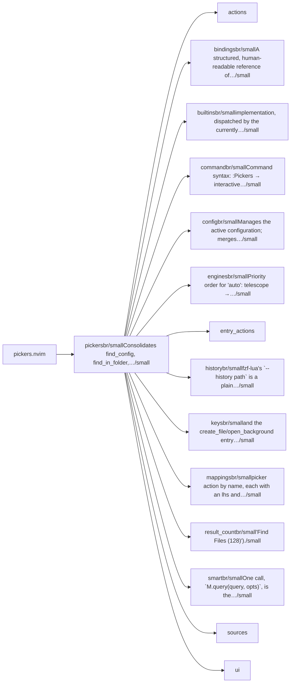
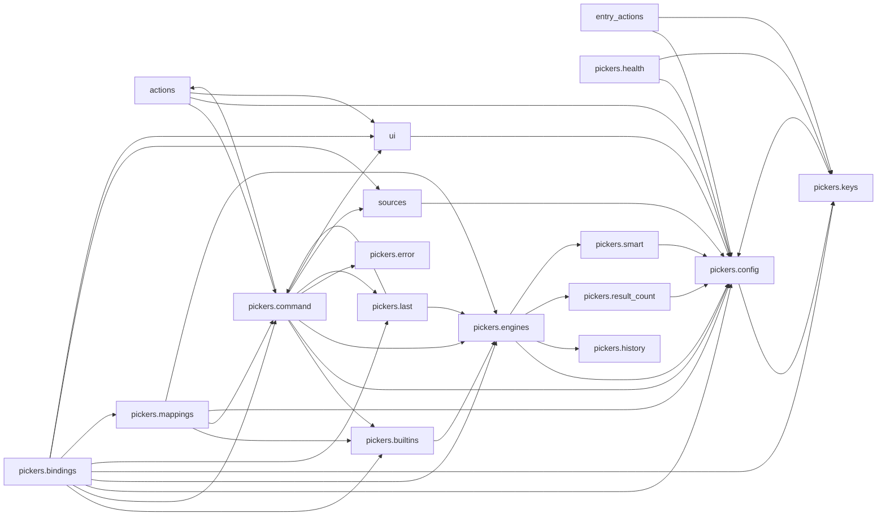

# pickers.nvim — module map

> **Generated** by `documentation`. Do not edit by hand — run `:DocMap`
> (or `nvim --headless -l scripts/gen_map.lua`) to regenerate.

**11 modules** · 8 namespaces · 44 helper files

The [interactive map](index.html) has filtering, full descriptions and
source links; this page is the version the code host renders directly.

## Namespaces

## Dependencies

Which parts of the tree require which, rolled up to the second level.
The [interactive map](index.html)'s **Deps** view has this per module,
in both directions, with load-time and lazy requires told apart.

## Modules

| Module | Description | Fns | Docs |
|---|---|---|---|
| `pickers` | Consolidates find_config, find_in_folder, dir_picker, repo_pickers, grep, search_all_drives and system_find into one plugin backed by a single telescope or… | 1 | [src](../../lua/pickers/init.lua) |
| &nbsp;&nbsp;`actions` |  |  |  |
| &nbsp;&nbsp;`pickers.bindings` | A structured, human-readable reference of every binding lives in `docs/BINDINGS.md`. | 1 | [src](../../lua/pickers/bindings/init.lua) |
| &nbsp;&nbsp;`pickers.builtins` | implementation, dispatched by the currently resolved engine. | 4 | [src](../../lua/pickers/builtins/init.lua) |
| &nbsp;&nbsp;`pickers.command` | Command syntax: :Pickers → interactive scope picker :Pickers <scope> → interactive action picker :Pickers <scope> <action> → direct :Pickers dir →… | 7 | [src](../../lua/pickers/command/init.lua) |
| &nbsp;&nbsp;`pickers.config` | Manages the active configuration; merges user options into defaults. | 5 | [src](../../lua/pickers/config/init.lua) |
| &nbsp;&nbsp;`pickers.engines` | Priority order for "auto": telescope → fzf → snacks. | 2 | [src](../../lua/pickers/engines/init.lua) |
| &nbsp;&nbsp;`entry_actions` |  |  | [README](../../lua/pickers/entry_actions/README.md) |
| &nbsp;&nbsp;&nbsp;&nbsp;`adapters` |  |  |  |
| &nbsp;&nbsp;&nbsp;&nbsp;`extract` |  |  |  |
| &nbsp;&nbsp;`pickers.history` | fzf-lua's `--history <path>` is a plain per-invocation CLI flag, so each provider (files/grep/item) can get its own file — see `fzf_path()`/`fzf_opts()` and… | 5 | [src](../../lua/pickers/history/init.lua) |
| &nbsp;&nbsp;`pickers.keys` | and the create_file/open_background entry actions — one config surface for everything that acts *inside* an open picker (as opposed to `keymaps`, which… | 7 | [src](../../lua/pickers/keys/init.lua) |
| &nbsp;&nbsp;&nbsp;&nbsp;`adapters` |  |  |  |
| &nbsp;&nbsp;`pickers.mappings` | picker action by name, each with an lhs and an optional per-entry engine override. | 3 | [src](../../lua/pickers/mappings/init.lua) |
| &nbsp;&nbsp;`pickers.result_count` | "Find Files (128)"). | 3 | [src](../../lua/pickers/result_count/init.lua) |
| &nbsp;&nbsp;`pickers.smart` | One call, `M.query(query, opts)`, is the single entry point every engine adapter drives. | 3 | [src](../../lua/pickers/smart/init.lua) |
| &nbsp;&nbsp;`sources` |  |  |  |
| &nbsp;&nbsp;`ui` |  |  |  |

## Drift

0 errors · 0 warnings · 25 info

No errors or warnings.

25 informational findings

| Check | Message |
|---|---|
| `missing-readme` | lua/pickers has no README.md |
| `missing-readme` | lua/pickers/bindings has no README.md |
| `missing-readme` | lua/pickers/builtins has no README.md |
| `missing-readme` | lua/pickers/command has no README.md |
| `missing-readme` | lua/pickers/config has no README.md |
| `missing-readme` | lua/pickers/engines has no README.md |
| `missing-readme` | lua/pickers/history has no README.md |
| `missing-readme` | lua/pickers/keys has no README.md |
| `missing-readme` | lua/pickers/mappings has no README.md |
| `missing-readme` | lua/pickers/result_count has no README.md |
| `missing-readme` | lua/pickers/smart has no README.md |
| `unreferenced-module` | pickers.bindings.autocmds is required by no other file in the tree |
| `unreferenced-module` | pickers.engines.fzf is required by no other file in the tree |
| `unreferenced-module` | pickers.engines.snacks is required by no other file in the tree |
| `unreferenced-module` | pickers.engines.telescope is required by no other file in the tree |
| `unreferenced-module` | pickers.entry_actions.adapters.fzf is required by no other file in the tree |
| `unreferenced-module` | pickers.entry_actions.adapters.snacks is required by no other file in the tree |
| `unreferenced-module` | pickers.entry_actions.adapters.telescope is required by no other file in the tree |
| `unreferenced-module` | pickers.health is required by no other file in the tree |
| `unreferenced-module` | pickers.sources.config is required by no other file in the tree |
| `unreferenced-module` | pickers.sources.cwd is required by no other file in the tree |
| `unreferenced-module` | pickers.sources.drives is required by no other file in the tree |
| `unreferenced-module` | pickers.sources.folder is required by no other file in the tree |
| `unreferenced-module` | pickers.sources.system is required by no other file in the tree |
| `unreferenced-module` | pickers.sources.wkdbooks is required by no other file in the tree |

